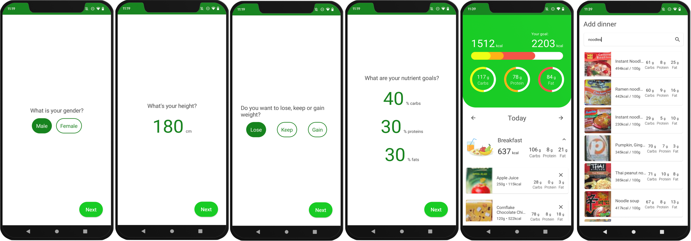

# Calory Tracker

- Application for keeping track of calories in your food. 
- For tests: JUnit 4, MockK, OkHttp MockWebServer, Compose UI Test
- Used: Kotlin + Coroutines, MVI + Clean Architecture, Dagger-Hilt, Retrofit, Compose Navigation, Jetpack Compose, Room Database, Coil